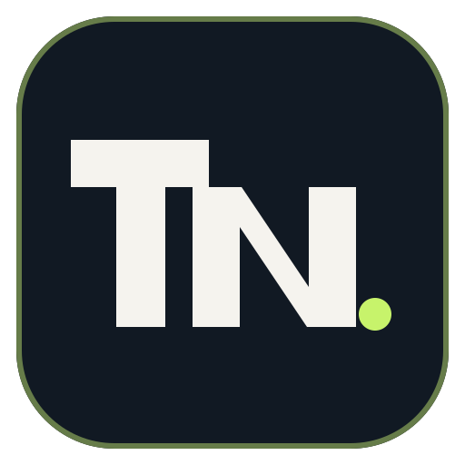
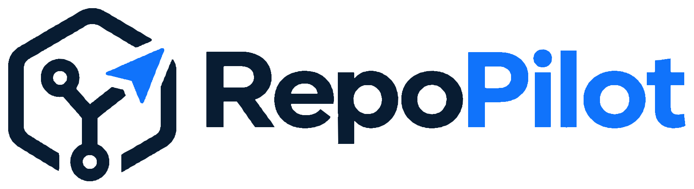
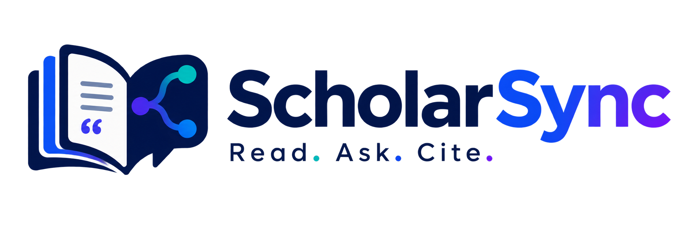

<p align="center">
  
</p>

<p align="center">
  
</p>

<p align="center">
  <a href="https://git.io/typing-svg">
    <picture>
      <source media="(prefers-color-scheme: dark)" srcset="https://readme-typing-svg.demolab.com?font=Fira+Code&size=20&pause=1000&color=C7F36B&center=true&vCenter=true&width=900&height=45&lines=Building+AI+systems+end-to-end+%E2%80%94+not+just+notebooks;3.5%2B+years+of+AI%2FML+experience;Agentic+AI+%7C+RAG+Pipelines+%7C+LLM+Systems;IEEE+Published+%7C+Open+to+ML%2FAI+Roles" />
      
    </picture>
  </a>
</p>

<p align="center">
  <a href="https://portfolio-rosy-psi-74.vercel.app/"></a>
  <a href="https://leetcode.com/u/mdtahammulnoor/"></a>
  <a href="https://www.geeksforgeeks.org/profile/thanos7"></a>
  <a href="mailto:noorali99307@gmail.com"></a>
  
</p>

---

## 👨‍💻 About Me

```python
class Tahammul:
    name        = "Md Tahammul Noor"
    alias       = "thanos07"
    experience  = "3.5+ years across AI, ML, and backend systems"
    degree      = "M.Tech CSE — NIT Jalandhar "
    prev        = "B.Tech IT — Muzaffarpur Institute of Technology "
    focus       = ["Agentic AI & LLM Systems", "RAG Pipelines", "Backend Dev", "Computer Vision"]
    published   = "IEEE AIEI 2026 — Geospatial Intelligence + Deep Learning for Solar Energy Planning"
    dsa         = "350+ problems solved · 10 LeetCode badges"
    open_to     = ["ML/AI Engineer Roles", "Data Science", "Research Collaborations"]
    email       = "noorali99307@gmail.com"
```

---

## 📄 Research & Publication

<p align="center">
  <a href="https://ieeexplore.ieee.org/document/11497333">
    
  </a>
</p>

> **Policy-Constrained Geospatial Intelligence: Integrating Deep Learning with Multi-Criteria Analysis for Solar Energy Planning**
>
> Lead Author · IEEE AIEI 2026 · NIT Jamshedpur · DOI: [10.1109/AIEI69164.2026.11497333](https://ieeexplore.ieee.org/document/11497333)
>
> Combines deep learning with multi-criteria spatial analysis to support renewable-energy site planning — applied to real geospatial datasets with data cleaning, validation logic, and decision-support modelling.

---

## 🚀 Featured Projects

<table>
  <tr>
    <td width="50%" valign="top">
      
      <h3>RepoPilot</h3>
      <p>AI-assisted code changes with isolated verification and human-controlled GitHub publishing.</p>
      <p>
        
        
        
        
        
      </p>
      <a href="https://github.com/thanos07/RepoPilot"></a>
      <a href="https://repopilot-cyan.vercel.app/"></a>
    </td>
    <td width="50%" valign="top">
      
      <h3>TriageIQ — Django AI</h3>
      <p>AI-assisted incident management with human-approved recovery, evidence, and audit trails.</p>
      <p>
        
        
        
        
      </p>
      <a href="https://github.com/thanos07/triageiq-django-ai"></a>
      <a href="https://triageiq-seven.vercel.app/"></a>
    </td>
  </tr>
  <tr>
    <td width="50%" valign="top">
      
      <h3>ScholarSync — Django</h3>
      <p>Evidence-grounded AI research workspace for academic PDFs.</p>
      <p>
        
        
        
        
      </p>
      <a href="https://github.com/thanos07/ScholarSync-Django"></a>
      <a href="https://scholarsync-ph9x.onrender.com/"></a>
    </td>
    <td width="50%" valign="top">
      
      <h3>ITR Compass</h3>
      <p>Prepare, compare, and review income-tax workpapers with controlled AI assistance.</p>
      <p>
        
        
        
        
      </p>
      <a href="https://github.com/thanos07/itr-compass"></a>
      <a href="https://itr-compass.vercel.app/"></a>
    </td>
  </tr>
  <tr>
    <td colspan="2" valign="top">
      <h3>🏗️ Construction Site Safety</h3>
      <p>Computer vision workflow for detecting site hazards with Florence-2, GroundingDINO, SAM2, YOLOv8, and ONNX.</p>
      <a href="https://github.com/thanos07/construction-site-safety"></a>
    </td>
  </tr>
</table>
---

## 🛠️ Tech Stack

**Languages**


**AI / GenAI / LLM**


**Retrieval & Reliability**


**Data & ML**


**Backend**


**Frontend**


**DevOps & Tools**


---

## 📊 GitHub Stats

<p align="center">
  
  
</p>

<p align="center">
  
</p>

---

## 🏆 Achievements

<p align="center">
  
  
  
</p>

- 🏅 **Certifications:** Deep Learning · AWS Fundamentals · Linux & Git
- 🎤 **Lead Volunteer** — WREC'25, NIT Jalandhar (managed 200+ delegates)
- 🏛️ **Joint Secretary** — BH3 Mess Committee (coordinated 300 students)

---

## 🌱 Currently

- 🔭 Building enterprise onboarding AI workflows that turn unstructured requests into validated data, with retrieval grounding and human review.
- 🧪 Improving reliability through deterministic guardrails, schema validation, and regression tests.
- 📬 **Open to AI/ML engineering roles** — reach me at [noorali99307@gmail.com](mailto:noorali99307@gmail.com)

---

<p align="center">
  
</p>
